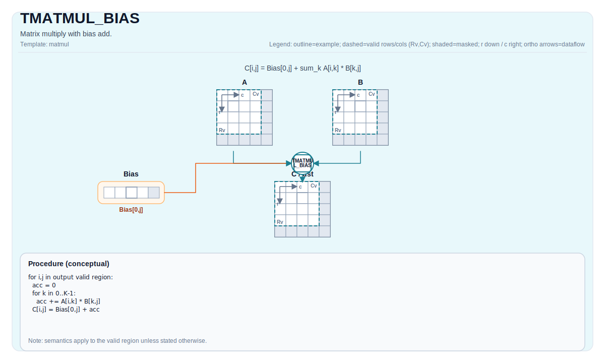

# TMATMUL_BIAS

## 指令示意图



## 简介

`TMATMUL_BIAS` 在矩阵乘法结果上再叠加一行 Bias Tile。它表达的是“矩阵乘法 + 列偏置”，而不是另一种不同的乘法。

这条指令常见于需要在 cube 计算后立刻加入每列偏置的场景，可以避免把乘法和偏置加法拆成两步理解。

## 数学语义

设：

- `M = aMatrix.GetValidRow()`
- `K = aMatrix.GetValidCol()`
- `N = bMatrix.GetValidCol()`

对 `0 <= i < M` 和 `0 <= j < N`：

$$ \mathrm{C}_{i,j} = \sum_{k=0}^{K-1} \mathrm{A}_{i,k} \cdot \mathrm{B}_{k,j} + \mathrm{Bias}_{0,j} $$

这里的 Bias Tile 只有一行，因此它按列广播到所有输出行。`bias[0, j]` 会加到结果矩阵的整列 `j` 上。

## 汇编语法

PTO-AS 形式：参见 [PTO-AS 规范](../../../../assembly/PTO-AS_zh.md)。

同步形式：

```text
%acc = tmatmul.bias %a, %b, %bias : (!pto.tile<...>, !pto.tile<...>, !pto.tile<...>) -> !pto.tile<...>
```

### AS Level 1（SSA）

```text
%c = pto.tmatmul.bias %a, %b, %bias : (!pto.tile<...>, !pto.tile<...>, !pto.tile<...>) -> !pto.tile<...>
```

### AS Level 2（DPS）

```text
pto.tmatmul.bias ins(%a, %b, %bias : !pto.tile_buf<...>, !pto.tile_buf<...>, !pto.tile_buf<...>) outs(%c : !pto.tile_buf<...>)
```

## C++ 内建接口

声明于 `include/pto/common/pto_instr.hpp`：

```cpp
template <typename TileRes, typename TileLeft, typename TileRight, typename TileBias, typename... WaitEvents>
PTO_INST RecordEvent TMATMUL_BIAS(TileRes &cMatrix, TileLeft &aMatrix, TileRight &bMatrix, TileBias &biasData,
                                  WaitEvents &... events);

template <AccPhase Phase, typename TileRes, typename TileLeft, typename TileRight, typename TileBias,
          typename... WaitEvents>
PTO_INST RecordEvent TMATMUL_BIAS(TileRes &cMatrix, TileLeft &aMatrix, TileRight &bMatrix, TileBias &biasData,
                                  WaitEvents &... events);
```

## 约束

### 通用约束

- `TMATMUL` 的所有 shape、位置、dtype 和 target-profile 约束，在这里同样成立。
- `biasData` 的元素类型必须与结果累加器 `TileRes::DType` 一致。
- `biasData` 必须是单行 Bias Tile，因为它表示“按列广播”的偏置。

### A2/A3 实现检查

- `TileBias::Loc == TileType::Bias`
- `TileBias::Rows == 1`

### A5 实现检查

- `TileBias::Loc == TileType::Bias`
- `TileBias::Rows == 1`
- `TileBias::isRowMajor == true`

### 目标差异说明

- 通用 A5 / A2A3 路径都把 bias 直接送入底层 cube bias 通道。
- CPU 模拟器则先完成普通矩阵乘法，再把 `bias[0, j]` 显式加到每一行的第 `j` 列上。
- 虽然实现方式不同，但对读者可见的合同是一致的：Bias 是“按列广播”。

## 示例

### 自动（Auto）

```cpp
#include <pto/pto-inst.hpp>

using namespace pto;

void example_auto() {
  using A = TileLeft<half, 16, 16>;
  using B = TileRight<half, 16, 16>;
  using Bias = Tile<TileType::Bias, float, 1, 16>;
  using C = TileAcc<float, 16, 16>;
  A a;
  B b;
  Bias bias;
  C c;
  TMATMUL_BIAS(c, a, b, bias);
}
```

### 手动（Manual）

```cpp
#include <pto/pto-inst.hpp>

using namespace pto;

void example_manual() {
  using A = TileLeft<half, 16, 16>;
  using B = TileRight<half, 16, 16>;
  using Bias = Tile<TileType::Bias, float, 1, 16>;
  using C = TileAcc<float, 16, 16>;
  A a;
  B b;
  Bias bias;
  C c;
  TASSIGN(a, 0x1000);
  TASSIGN(b, 0x2000);
  TASSIGN(bias, 0x3000);
  TASSIGN(c, 0x4000);
  TMATMUL_BIAS(c, a, b, bias);
}
```

## 相关页面

- [TMATMUL](./tmatmul_zh.md)
- [TMATMUL_ACC](./tmatmul-acc_zh.md)
- [矩阵与矩阵向量指令集](../../matrix-and-matrix-vector_zh.md)
