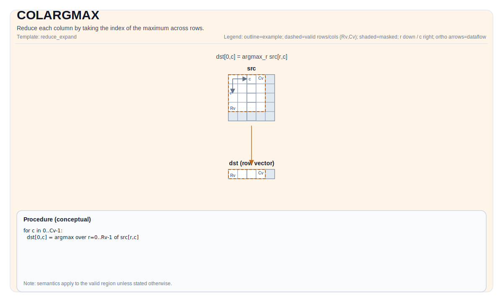

# TCOLARGMAX

## 指令示意图



## 简介

`TCOLARGMAX` 对输入 Tile 的每一列做一次“取最大值位置”的归约，输出的是**行索引**，不是最大值本身。它适合放在需要后续定位、重排或选择的场景里；如果你只关心最大值本身，更直接的指令是 `TCOLMAX`。

输出 Tile 只保留一行。第 `j` 列的结果 `dst[0, j]` 表示：在源 Tile 的第 `j` 列里，最大元素出现在第几行。

## 数学语义

设：

- `R = src.GetValidRow()`
- `C = src.GetValidCol()`

对 `0 <= j < C`：

$$ \mathrm{dst}_{0,j} = \underset{0 \le i < R}{\operatorname{argmax}} \; \mathrm{src}_{i,j} $$

当一列里有多个相同的最大值时，平局如何打破由实现决定。可移植代码不应依赖某个固定的 tie-breaking 行为。

## 汇编语法

PTO-AS 形式：参见 [PTO-AS 规范](../../../../assembly/PTO-AS_zh.md)。

同步形式：

```text
%dst = tcolargmax %src : !pto.tile<...> -> !pto.tile<...>
```

在 lowering 过程中，backend 可能会引入临时 scratch Tile；C++ 内建接口因此显式接收 `tmp` 操作数。

### AS Level 1（SSA）

```text
%dst = pto.tcolargmax %src, %tmp : (!pto.tile<...>, !pto.tile<...>) -> !pto.tile<...>
```

### AS Level 2（DPS）

```text
pto.tcolargmax ins(%src, %tmp : !pto.tile_buf<...>, !pto.tile_buf<...>) outs(%dst : !pto.tile_buf<...>)
```

## C++ 内建接口

声明于 `include/pto/common/pto_instr.hpp`：

```cpp
template <typename TileDataOut, typename TileDataIn, typename TileDataTmp, typename... WaitEvents>
PTO_INST RecordEvent TCOLARGMAX(TileDataOut& dst, TileDataIn& src, TileDataTmp& tmp, WaitEvents&... events);
```

## 约束

### 通用约束

- `src` 和 `dst` 都必须是 `TileType::Vec`。
- `dst` 的元素类型必须是 `uint32_t` 或 `int32_t`。
- `src` 必须使用非分形布局（`SLayout::NoneBox`）；当前实现允许 ND 或 DN 这两类非分形输入。
- `dst` 必须是标准 ND 输出：row-major 且非分形（`BLayout::RowMajor`、`SLayout::NoneBox`）。
- 运行时要求：
  - `src.GetValidRow() != 0`
  - `src.GetValidCol() != 0`
  - `dst.GetValidRow() == 1`
  - `dst.GetValidCol() == src.GetValidCol()`
- 当前 backend 的编译期检查还要求 `TileDataIn::ValidCol` 取 `-1`（动态 validCol）或 `1`。

### A2/A3 实现检查

- 支持的源元素类型是：
  `half`、`float`、`uint16_t`、`uint32_t`。
- `tmp` 的元素类型必须与 `src` 完全一致。
- A2/A3 路径里 `tmp` 会被真正使用，用来保存当前比较值和中间索引。

#### A2/A3 `tmp` 的使用方式

- `tmp` 在单行空间内按三个区域组织：
  - 区域 0：当前行号计数器
  - 区域 1：当前列最大值
  - 区域 2：当前 argmax 结果
- 当 `srcValidCol >= elementPerRepeat` 时，临时区块宽度取 `elementPerRepeat`。
- 当 `srcValidCol < elementPerRepeat` 时，临时区块宽度按 block 对齐：

```text
tmpGapEles = ceil(validCol / elementPerBlock) * elementPerBlock
```

- 在小 Tile 上，通常把 `tmp` 直接做成与 `src` 同尺寸就足够；若需要精确估算 stride，可按下面公式计算：

```text
repeats = ceil(validCol / elementPerRepeat)
stride = ceil(repeats * 2 / elementPerBlock) * elementPerBlock
       + ceil(repeats / elementPerBlock) * elementPerBlock
```

### A5 实现检查

- A5 接受 8 位、16 位或 32 位源元素，因此覆盖：
  `int8_t`、`uint8_t`、`int16_t`、`uint16_t`、`int32_t`、`uint32_t`、`half`、`float`。
- A5 的接口仍保留 `tmp` 参数，但当前实现并不会使用它；它保留下来主要是为了和 A2/A3 共用一套 C++ 接口。

## 示例

### 自动（Auto）

```cpp
#include <pto/pto-inst.hpp>

using namespace pto;

void example_auto() {
  using SrcT = Tile<TileType::Vec, float, 16, 256, BLayout::RowMajor, -1, -1>;
  using DstT = Tile<TileType::Vec, uint32_t, 1, 256, BLayout::RowMajor, -1, -1>;
  using TmpT = Tile<TileType::Vec, float, 1, 32, BLayout::RowMajor, -1, -1>;
  SrcT src(16, 255);
  DstT dst(1, 255);
  TmpT tmp(1, 32);
  TCOLARGMAX(dst, src, tmp);
}
```

### 手动（Manual）

```cpp
#include <pto/pto-inst.hpp>

using namespace pto;

void example_manual() {
  using SrcT = Tile<TileType::Vec, float, 16, 256, BLayout::RowMajor, -1, -1>;
  using DstT = Tile<TileType::Vec, uint32_t, 1, 256, BLayout::RowMajor, -1, -1>;
  using TmpT = Tile<TileType::Vec, float, 1, 32, BLayout::RowMajor, -1, -1>;
  SrcT src(16, 255);
  DstT dst(1, 255);
  TmpT tmp(1, 32);
  TASSIGN(src, 0x0);
  TASSIGN(dst, 0x1000);
  TASSIGN(tmp, 0x2000);
  TCOLARGMAX(dst, src, tmp);
}
```

## 相关页面

- [归约与扩展指令集](../../reduce-and-expand_zh.md)
- [TCOLMAX](./tcolmax_zh.md)
- [布局参考](../../../state-and-types/layout_zh.md)
